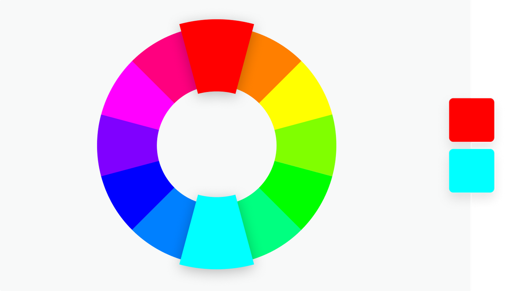

## Complementary

Two colors that are on opposite sides of the color wheel. This combination provides a high contrast and high impact color combination – together, these colors will appear brighter and more prominent.
